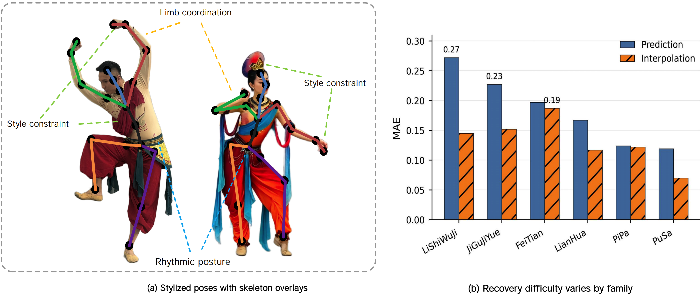
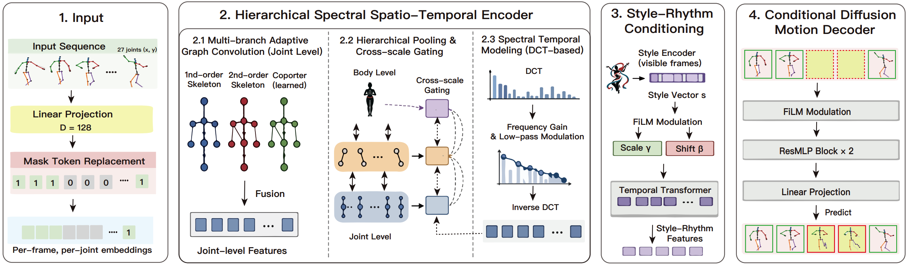

# Spectral Graph Diffusion for Style-Preserving Skeletal Motion Completion

PyTorch model skeleton for **Hierarchical Spectral Graph Diffusion (HSGD)**, a style-preserving skeletal motion completion framework for Dunhuang dance motion sequences.

This initial release focuses on the deep-learning framework and the core model implementation. Training, evaluation, dataset preprocessing, and checkpoint files are intentionally kept out of this first code drop and will be added after cleanup.

## Method Overview



HSGD models partially observed skeletal motion with a unified mask formulation. Visible frames provide coordinate context, while missing frames are represented by learnable mask tokens. A hierarchical spectral graph encoder captures joint-, limb-, and body-level dependencies, applies temporal spectral modulation, and conditions a diffusion decoder with style-rhythm information extracted from observed motion.

## Completion Examples



The model is designed for three completion settings used in the paper:

- **Prediction**: future frames are missing.
- **Interpolation**: middle frames are missing between observed endpoints.
- **Random completion**: frames are missing at random positions.

## Repository Layout

```text
hsgd-dunhuang-dance/
|-- assets/images/              # README figures
|-- configs/                    # Default model/task configuration
|-- docs/                       # Release notes
|-- scripts/                    # Lightweight utility scripts
|-- src/hsgd/                   # Python package
|   |-- __init__.py
|   |-- bvh_utils.py.example    # Skeleton metadata template
|   `-- model.py                # Core HSGD model
|-- tests/                      # Basic import/smoke checks
|-- pyproject.toml
|-- requirements.txt
`-- README.md
```

## Installation

```bash
git clone https://github.com/BinNiu-Dance/hsgd-dunhuang-dance.git
cd hsgd-dunhuang-dance
python -m pip install -r requirements.txt
```

For editable local development:

```bash
python -m pip install -e .
```

## Required Skeleton Metadata

The model imports four dataset-specific constants:

- `NUM_JOINTS`
- `PARENTS`
- `LIMB_GROUPS`
- `NUM_FAMILIES`

Copy `src/hsgd/bvh_utils.py.example` to `src/hsgd/bvh_utils.py` and replace the placeholder skeleton topology and family count with the metadata used by your BVH preprocessing pipeline.

## Minimal Model Usage

```python
import torch
from hsgd.model import DunhuangMotionModel, diffusion_x0_loss

model = DunhuangMotionModel(dim=128, hst_blocks=3, trf_depth=2, nhead=4)

x = torch.randn(2, 60, 27, 2)        # (batch, frames, joints, xy)
mask = torch.zeros(2, 60).bool()     # True means hidden frame
mask[:, 40:] = True                  # prediction-style mask

out = model(x, mask)
completed = out["pred"]

train_out = model.forward_train(x, mask)
loss, loss_items = diffusion_x0_loss(train_out["pred"], x, mask)
```

## Model Components

- Unified masked motion modeling for prediction, interpolation, and random missing-frame completion.
- Multi-hop adaptive joint graph convolution over the 27-joint skeleton.
- Hierarchical joint-limb-body representation with cross-scale fusion.
- DCT-based temporal spectral modulation.
- Style-rhythm conditioning through visible-frame attention pooling and FiLM modulation.
- Conditional diffusion decoder with visible-frame clamping during sampling.

## Development Notes

This repository is a lightweight release of the model side of the project. It does not include raw BVH data, private preprocessing outputs, trained checkpoints, or submission files.

## Citation

```bibtex
@misc{niu2026hsgd,
  title={Spectral Graph Diffusion for Style-Preserving Skeletal Motion Completion},
  author={Niu, Bin and Wang, Yitong and Yang, Rui},
  year={2026},
  note={Code release}
}
```

## Contact

- Bin Niu: bin_niu@nwnu.edu.cn
- Rui Yang: rykeryang@163.com
